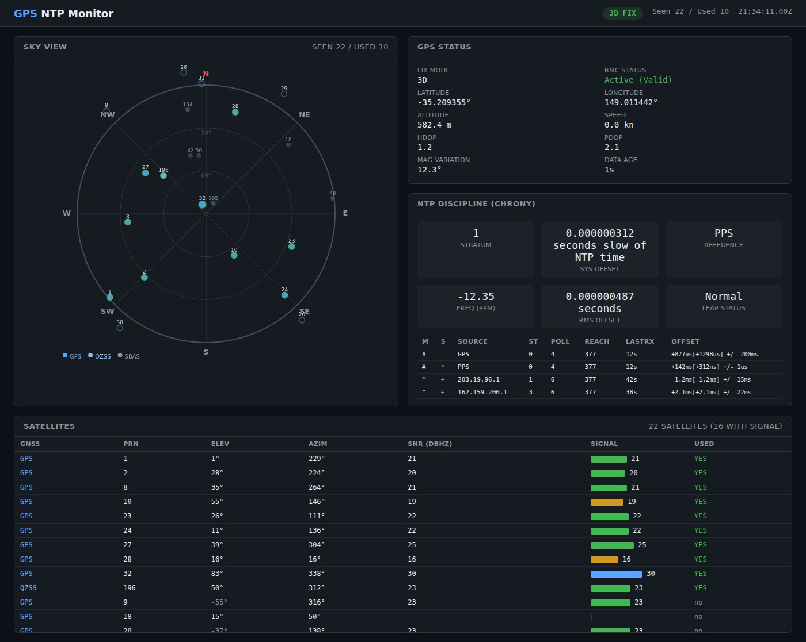

# GPSSAT — GPS-Disciplined NTP Server Monitor

A web-based monitoring dashboard for GPS-disciplined NTP time servers. Connects to `gpsd` and `chrony` to display real-time satellite tracking, fix status, and NTP synchronisation health on a dark-themed single-page dashboard.

Designed for headless Linux servers (Ubuntu 24.04 LTS) running a u-blox GPS receiver with PPS output, feeding time into chrony for stratum-1 NTP service.



## Features

- **Sky plot** — polar view of all visible GNSS satellites (GPS, GLONASS, Galileo, BeiDou, QZSS, SBAS) colour-coded by constellation, with used satellites highlighted
- **GPS status panel** — fix mode, position, altitude, speed, DOP values, magnetic variation, and data age
- **NTP discipline panel** — chrony stratum, system time offset, reference source, frequency drift, RMS offset, and leap-second status
- **Chrony sources table** — live view of all NTP sources with selection state, polling interval, reachability, and measured offset
- **Satellite table** — detailed per-satellite view with PRN, elevation, azimuth, SNR signal-strength bars, and in-use status
- **Auto-refresh** — dashboard polls the backend every 2 seconds
- **Multi-constellation support** — identifies GPS, GLONASS, Galileo, BeiDou, QZSS, SBAS, and IRNSS from both NMEA talker IDs and PRN ranges
- **Dual data path** — connects via the Python `gps` library, with automatic fallback to `gpspipe` subprocess

## Architecture

```
┌──────────┐     ┌──────┐     ┌──────────────────┐     ┌─────────┐
│ GPS      │────▶│ gpsd │────▶│ gpssat (Flask)   │◀───▶│ Browser │
│ Receiver │     └──────┘     │  - GpsPoller     │     │         │
│ + PPS    │         │        │  - NmeaParser    │     │ Sky plot │
└──────────┘         │        │  - ChronyClient  │     │ Tables  │
                     ▼        └──────────────────┘     └─────────┘
               ┌──────────┐
               │  chrony  │
               │ (NTP)    │
               └──────────┘
```

### Components

| File | Purpose |
|---|---|
| `gpssat/app.py` | Flask web app with REST API endpoints (`/api/status`, `/api/gps`, `/api/chrony`) |
| `gpssat/gps_client.py` | Background thread connecting to gpsd; parses NMEA sentences (RMC, GSA, GSV, GGA) and gpsd JSON (TPV, SKY); maintains thread-safe `GpsState` |
| `gpssat/chrony_client.py` | Runs `chronyc` commands and parses tracking, sources, and sourcestats output |
| `gpssat/templates/index.html` | Single-file dashboard with embedded CSS/JS, canvas sky plot, and auto-polling |
| `config/chrony.conf` | Chrony config with GPS SHM + PPS refclocks and NTP pool fallback |
| `config/gpsd.conf` | gpsd config for u-blox USB receiver with PPS |
| `config/gpssat.service` | systemd unit file for the web monitor |
| `setup.sh` | Automated installer for Ubuntu 24.04 LTS |
| `tests/test_parser.py` | NMEA parser tests using real captured satellite data |

## Requirements

- **OS**: Ubuntu 24.04 LTS (or similar Debian-based)
- **Hardware**: USB GPS receiver (u-blox recommended) with PPS output
- **System packages**: `gpsd`, `chrony`, `python3`, `pps-tools`
- **Python**: 3.12+ with `flask` and `gps` libraries

## Quick Start

### Automated Setup

```bash
sudo ./setup.sh
```

This installs all dependencies, configures gpsd and chrony, creates a system user, deploys the application to `/opt/gpssat`, and starts all services. The web UI will be available on port 5000.

### Manual Setup

```bash
# Install system packages
sudo apt install gpsd gpsd-clients chrony python3 python3-venv pps-tools

# Configure gpsd and chrony
sudo cp config/gpsd.conf /etc/default/gpsd
sudo cp config/chrony.conf /etc/chrony/chrony.conf
sudo systemctl restart gpsd chrony

# Set up the application
python3 -m venv venv
source venv/bin/activate
pip install -r requirements.txt

# Run
python3 -m gpssat.app
```

### Environment Variables

| Variable | Default | Description |
|---|---|---|
| `GPSSAT_HOST` | `0.0.0.0` | Web server bind address |
| `GPSSAT_PORT` | `5000` | Web server port |
| `GPSD_HOST` | `localhost` | gpsd host |
| `GPSD_PORT` | `2947` | gpsd port |
| `GPSSAT_DEBUG` | `0` | Set to `1` to enable Flask debug mode |

## API Endpoints

| Endpoint | Description |
|---|---|
| `GET /` | Dashboard HTML page |
| `GET /api/status` | Combined GPS + Chrony JSON status |
| `GET /api/gps` | GPS-only JSON status (fix, position, satellites) |
| `GET /api/chrony` | Chrony-only JSON status (tracking, sources) |

## Running Tests

```bash
python3 tests/test_parser.py
```

Tests validate the NMEA parser against real satellite data captured from a live system, covering checksum validation, RMC/GSA/GSV parsing, negative elevations, multi-constellation identification, and gpsd JSON parsing.

## Chrony Configuration

The included `config/chrony.conf` sets up:

- **SHM 0** (GPS NMEA) — coarse time via gpsd shared memory, marked `noselect` (used only for second numbering)
- **SHM 1** (PPS) — precise pulse-per-second via gpsd, marked `prefer trust` for sub-microsecond accuracy
- **NTP pool fallback** — Australian NTP pool + Cloudflare for when GPS is unavailable
- **Local network serving** — allows NTP clients on RFC 1918 ranges

## License

See repository for license details.
